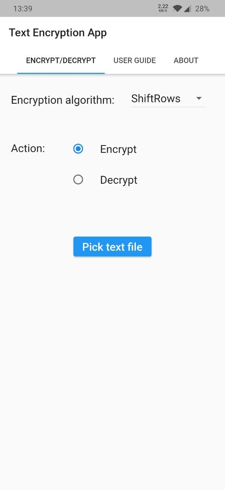
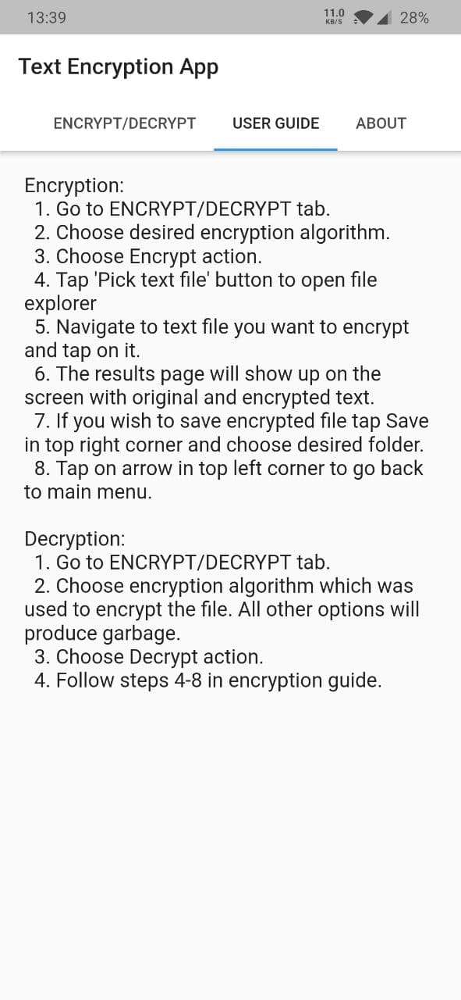
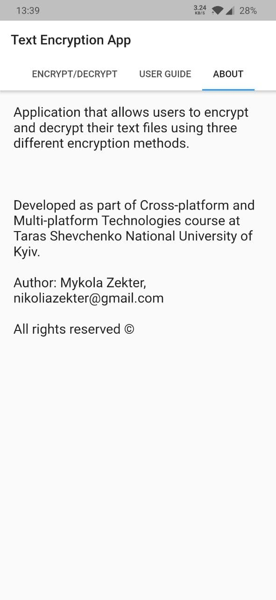

# Text encryption app

Cross-platform text file encryption application built with Flutter. 

It allows users to encrypt and decrypt their own text files and save the results into separate files. Besides main functionality, the interface also lets user access short user guide with instruction how to use the app and information about the assignment and the author.

## Supported platforms

 - Web
 - Android
 
Note: it's likely that iOS support could be easily added but it was not tested and required modifications are unknown.

## Encryption algorithms
 
There are three encryption algorithms implemented in the app. They are actually parts of AES cipher round function repurposed as standalone algoritms, namely:

- ShiftRows
- SubBytes
- MixColumns

and their inverses for decryption.

## Screenshots

  
